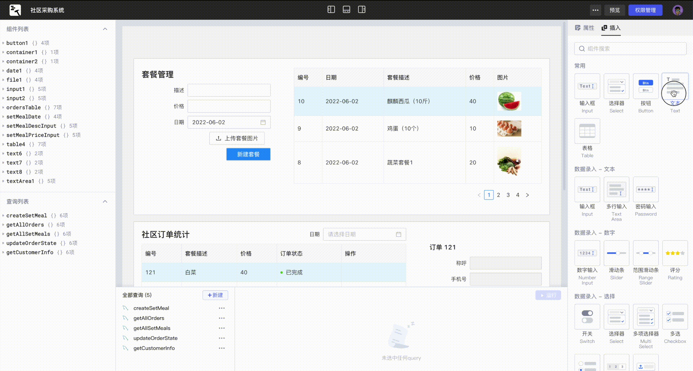

# Lowcoder是什么

Lowcoder是一款开发者友好的低代码平台。通过开箱即用的组件库、所见即所得 UI 布局以及连接数据库/API，您可以快速开发内部应用，同时无需关注复杂繁琐的前后端交互、应用的安装与部署，让您专注于业务发展。

​

## 如何搭建一个应用？

只需通过几个步骤，便可搭建和使用您的内部应用：

1. 通过 GUI 快速[连接数据源](./datasource)。
2. 编写少量代码[构建查询](./how-to-write-query)。
3. 使用开箱即用的组件库轻松[搭建应用界面](./drag-and-drop)，使用 [JavaScript 表达式](./javascript-in-lowcoder/writing-javascript)绑定查询数据。
4. 触发查询/控制组件/响应用户行为/...，通过设置[事件触发](./event-handler)提供响应式 UI 交互。
5. [预览](./app-release)并将您的应用[分享给其他人](./member-manage#%E6%B7%BB%E5%8A%A0%E6%88%90%E5%91%98)。

* [教程：如何搭建一个应用？](./quick-tutorial.md)
