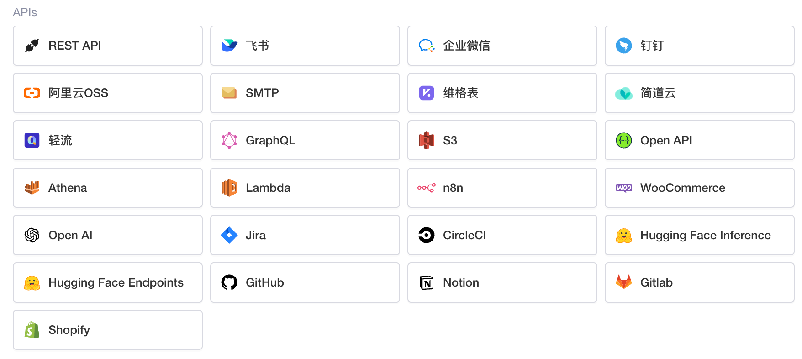

# 连接 API

​

Lowcoder支持连接多种类型的 API，可通过以下文档了解如何连接各种 API：

* [连接 REST API](../api/rest-api)
* [连接飞书](../api/feishu)
* [连接企业微信](../api/wecom)
* [连接钉钉](../api/dingtalk)
* [连接阿里云 OSS](../api/aliyun)
* [连接 SMTP](../api/smtp)
* [连接维格表](../api/vika)
* [连接简道云](../api/jiandaoyun)
* [连接 GraphQL](../api/graphql)
