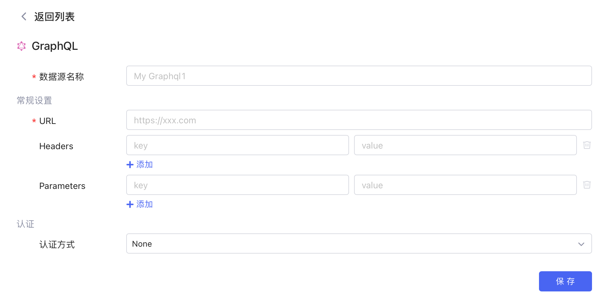
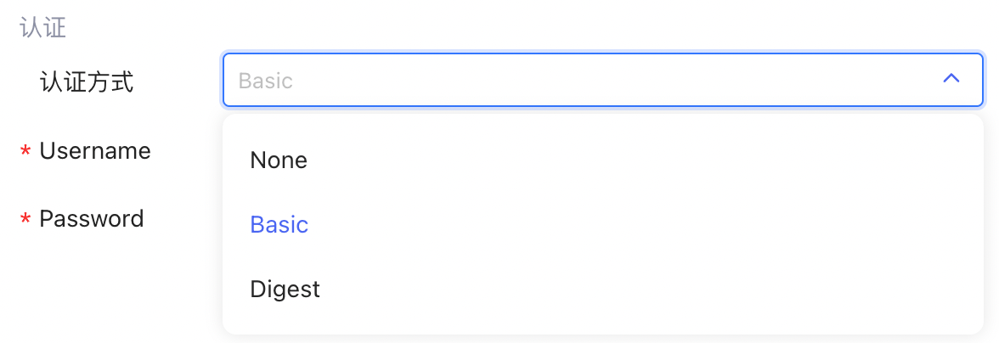
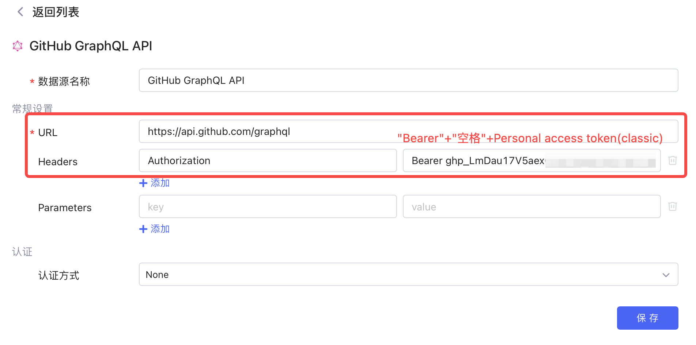
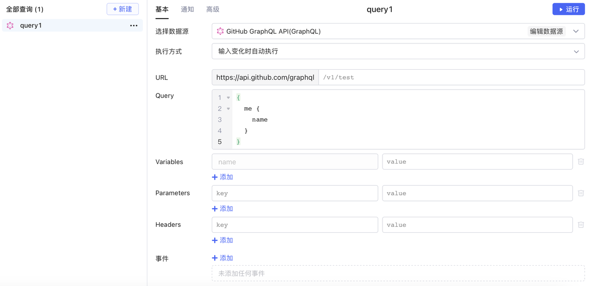
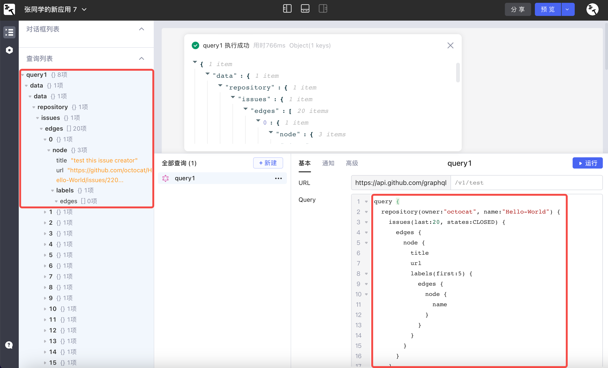

# 连接 GraphQL

## 新建数据源

​**新建数据源 -&gt; GraphQL**​，与[连接 REST API](../api/rest-api) 类似，数据源中可配置查询所公用的参数：如 URL 前缀、Headers 和 Parameters，之后可基于该数据源创建查询。

​

## 认证方式

GraphQL 数据源的默认**认证方式**为 None。其他可选项为 Basic 和 Digest，需要配置 Username 和 Password。如果有其他认证方式的需求，请联系首页客服人员。

​

以连接 [GitHub GraphQL API](https://docs.github.com/zh/graphql) 为例：选择认证方式为 ​**None**​，参考[创建个人访问令牌](https://docs.github.com/zh/authentication/keeping-your-account-and-data-secure/creating-a-personal-access-token)文档生成 personal access token，再按下图格式填入 Headers 中，即可完成认证方式的配置。

​

## 创建查询

创建查询，选择您的 GraphQL 数据源，填写 Query、变量、参数等信息，然后点击​**运行**​。关于在Lowcoder中使用 GraphQL 查询语言的详细教程，请参阅 [GraphQL 入门](https://graphql.cn/learn/)。

​

以 [GitHub GraphQL API](https://docs.github.com/zh/graphql) 为例，创建一个查询，用于查找 `octocat/Hello-World`​ 代码仓库的 20 个最近关闭的问题，并返回每个问题的标题、URL 和前 5 个标签。如下图，查询返回的 JSON 结果与 Query 中填写的查询语句的结构是一致的：

​
