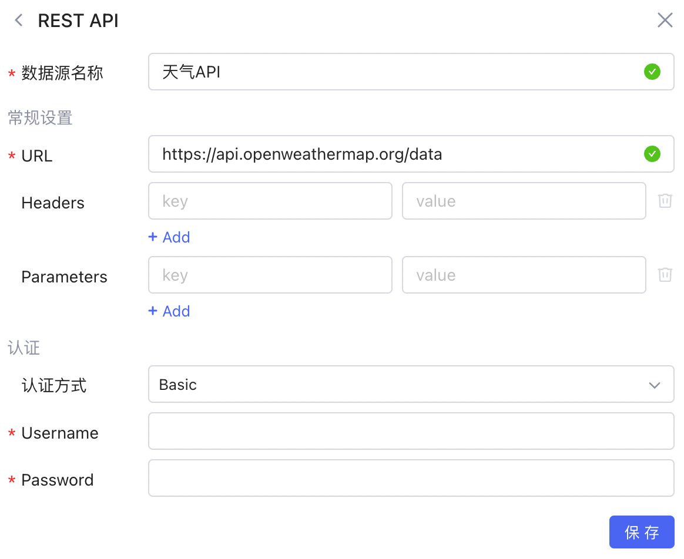
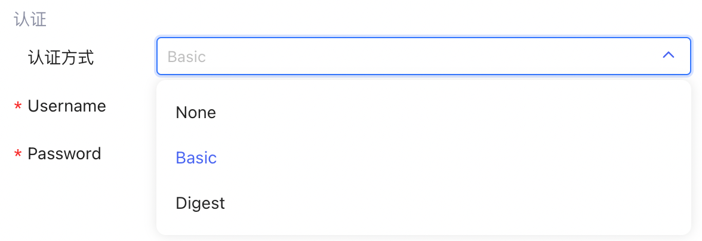
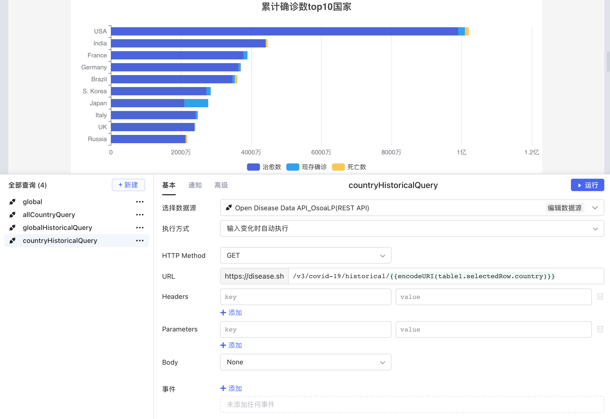

# 连接 REST API

## 新建数据源

**新建数据源** -> ​**REST API**​，数据源中可配置查询所公用的参数：如 URL 前缀、Headers 和 Parameters，之后可基于该数据源创建查询。

​

## 认证方式

REST API 的默认**认证方式**为 None。其他可选项为 Basic 和 Digest，需要配置 Username 和 Password。

​

如果有其他认证方式的需求，请联系首页客服人员。

## 创建查询

创建查询，选择您的 REST API 数据源，然后设置查询参数信息，即可点击​**运行**​。关于在Lowcoder中使用 REST API 的详细教程，请参阅 [使用 REST API](https://majiang.co/docs/using-rest-api)。

​

* [新建数据源](https://majiang.co/docs/api/rest-api#%E6%96%B0%E5%BB%BA%E6%95%B0%E6%8D%AE%E6%BA%90)
* [认证方式](https://majiang.co/docs/api/rest-api#%E8%AE%A4%E8%AF%81%E6%96%B9%E5%BC%8F)
* [创建查询](https://majiang.co/docs/api/rest-api#%E5%88%9B%E5%BB%BA%E6%9F%A5%E8%AF%A2)
