# 使用文件上传组件

## 基本设置

在画布右侧的属性面板，可以修改文件上传组件的基本设置，如组件文本、文件类型、上传类型等。

### 文件类型

可填入一个 **字符串数组** ，用于限制可上传的文件类型；默认为空，即可上传所有类型的文件。其中每个字符串是一个[唯一文件类型说明符](https://developer.mozilla.org/zh-CN/docs/Web/HTML/Element/input/file#%E5%94%AF%E4%B8%80%E6%96%87%E4%BB%B6%E7%B1%BB%E5%9E%8B%E8%AF%B4%E6%98%8E%E7%AC%A6)， 可以采用下列形式之一：

* 一个以英文句号 “.” 开头的合法的不区分大小写的文件名扩展名。例如：`.jpg`、`.pdf` 或 `.doc`。
* 一个不带扩展名的 [MIME 类型](https://developer.mozilla.org/zh-CN/docs/Web/HTTP/Basics_of_HTTP/MIME_types)字符串。
* 字符串 `audio/*`，表示“任何音频文件”。
* 字符串 `video/*`，表示“任何视频文件”。
* 字符串 `image/*`，表示“任何图片文件”。

例如，填入 `["image/*", ".pdf", ".mp4"]` 表示可上传任何图片文件、`pdf` 文件和 `mp4` 文件。

### 上传类型

点击展开下拉框，可选择上传 **单个文件** 、**多文件**或 **文件夹** 。

### 是否展示上传列表

可点击开关进行切换，也可通过 JS 代码传入 Boolean 值进行控制；默认为**开启**状态，即值为 `true`。

上传列表展示所有文件的 **名称** （可以通过组件的 `files[index].name` 属性访问），点击列表右侧 🗑️ 图标可以删除某一文件。

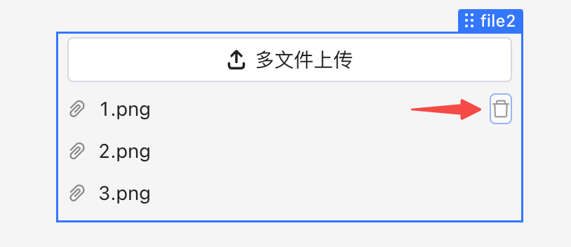

### 解析文件

可点击开关进行切换，默认为**关闭**状态。如果开启 **解析文件** ，上传的所有文件会被解析为对象、数组或字符串，可以通过组件的 `parsedValue` 属性访问。目前支持解析 Excel、JSON、CSV 或文本文件，其他文件类型会返回 null。

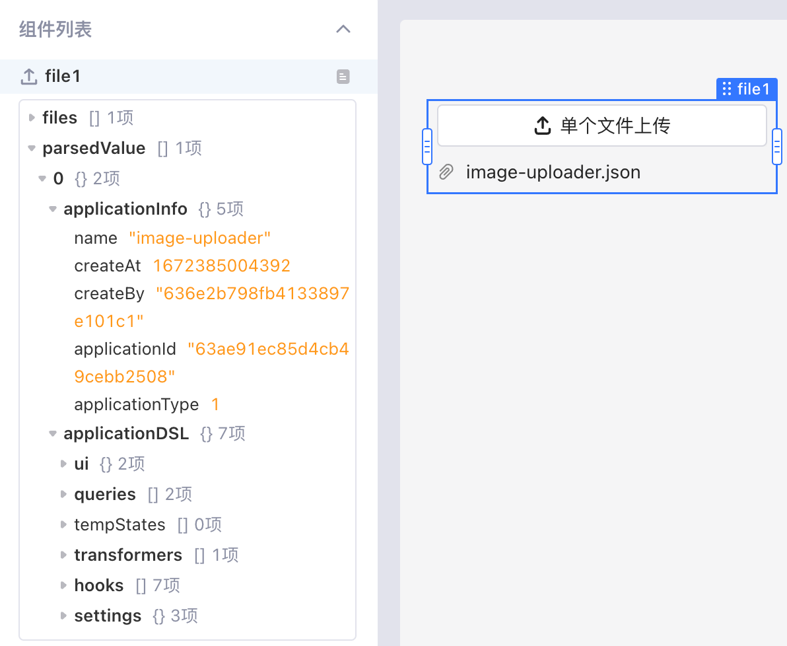

## 校验设置

校验设置用于检验用户上传的文件是否超过规定数量，或者文件大小超过限制等。

### 文件最大上传数

组件的上传类型为**多文件**或**文件夹**时，可以设置 **文件最大上传数** 。当上传的文件数量超过设定值时，新上传的文件将会**覆盖**旧文件。

### 文件大小

可以指定上传**文件大小**的最大值和最小值，支持单位包括 kb/mb/gb/tb，例如 5kb 或 10mb。输入值无具体单位时，默认单位为 byte。

当预上传的文件大小不符合设定范围时，将会触发全局提示。

## 访问已上传文件

通过文件上传组件上传文件后，Lowcoder会将文件内容进行 **Base64** 编码并暂存于浏览器内存中。您需要通过新建查询与数据库或 API 交互，从而将文件上传并保存。

已上传文件的常用属性如下，您可以在数据浏览器中直接查看，也可以在 `{{ }}` 或 JS 查询中通过属性名访问。

* `value`：当前上传的文件内容列表，文件内容经过 Base64 编码。
* `files`：当前上传的文件信息列表，包含 `uid`、`name`、`type`、`size` 和 `lastModified`字段。
* `parsedValue`：已解析的文件值列表。如果开启解析文件，上传文件会被解析为对象、数组或字符串。支持 Excel、JSON、CSV 或文本文件，其他类型会返回 null。

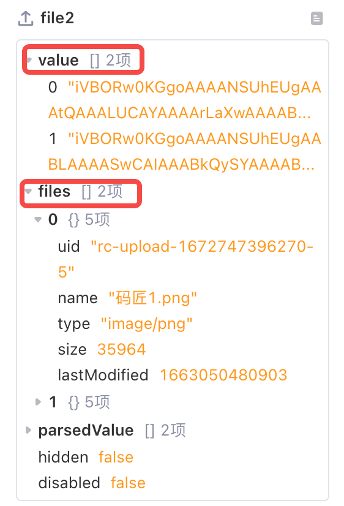

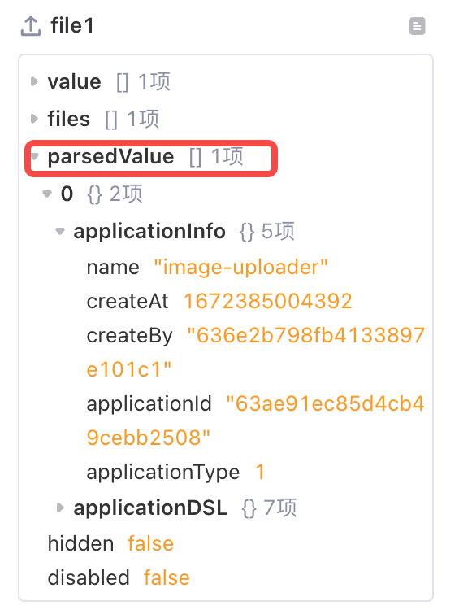

## 案例：上传图片至 Postman Echo API

本案例通过调用 Postman [Echo API](https://learning.postman.com/docs/developer/echo-api/)，将图片文件上传至 API，并通过返回结果测试是否上传成功。

### 单张上传

1. 插入一个文件上传组件 `file1`，配置好文件类型和上传类型。
    
2. 插入一个图片组件 `image1`，配置好图片地址 `data:image;base64,{{file1.value[0]}}`，用于预览暂存于浏览器的单张图片。
    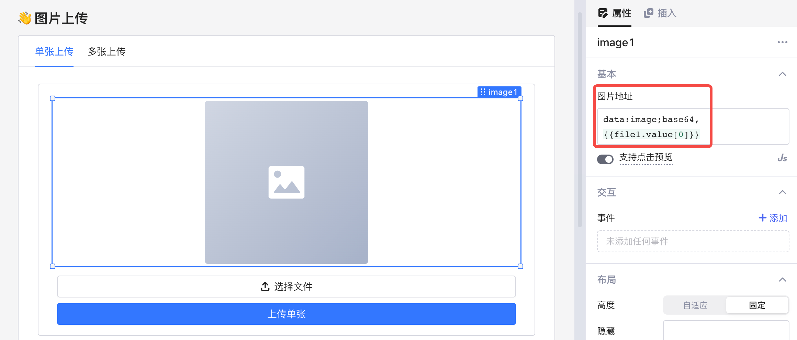
3. 新建一个查询 `uploadSingle`，用于将单张图片上传至 Echo API，可以插入一个按钮，并将其单击事件绑定至该查询。选择 HTTP Method 为  **POST** ，然后将已编码的图片内容 `{{file1.value[0]}}` 和图片名称 `{{file1.files[0].name}}` 按照 `{ data: base64 string, name: string }` 的格式填写至请求主体 Body 中，如下图所示。
    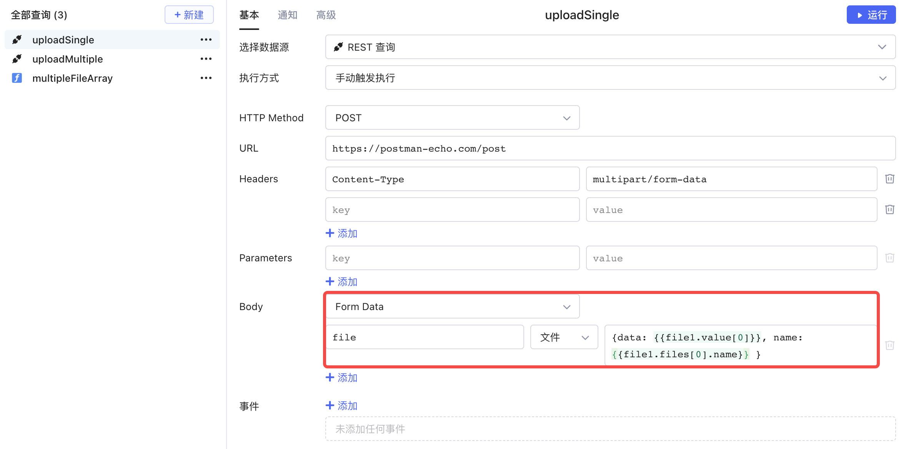
4. 运行查询  `uploadSingle`，返回值如下图所示。新建一个文本组件，用于展示返回值中的文件名，可通过 `{{Object.keys(uploadSingle.data?.files?? [])[0]}}` 访问；新建一个图片组件，用于展示返回的图片文件，图片地址可通过 `{{Object.values(uploadSingle.data?.files ?? [])[0]}}` 访问。
    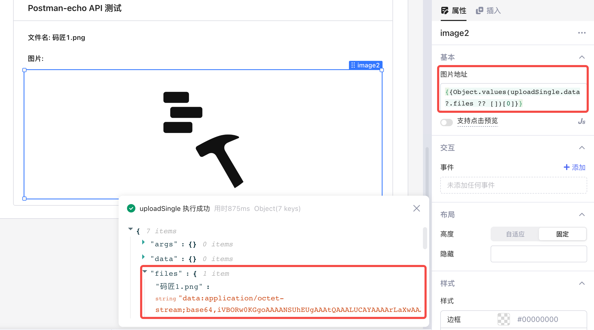

### 多张上传

上传多张图片时，需要向 Echo API 提交一个 Object 数组，其中每一项都需遵循 `{ data: base64 string, name: string }` 的格式。因此，可以新建一个转换器 `multipleFileArray`，将当前文件列表的 `value` 和 `files` 字段的值转换成所需格式，如下图所示。

新建一个查询 `uploadMultiple`，用于将多张图片上传至 Echo API，这里可以直接填入 `multipleFileArray` 的返回值。

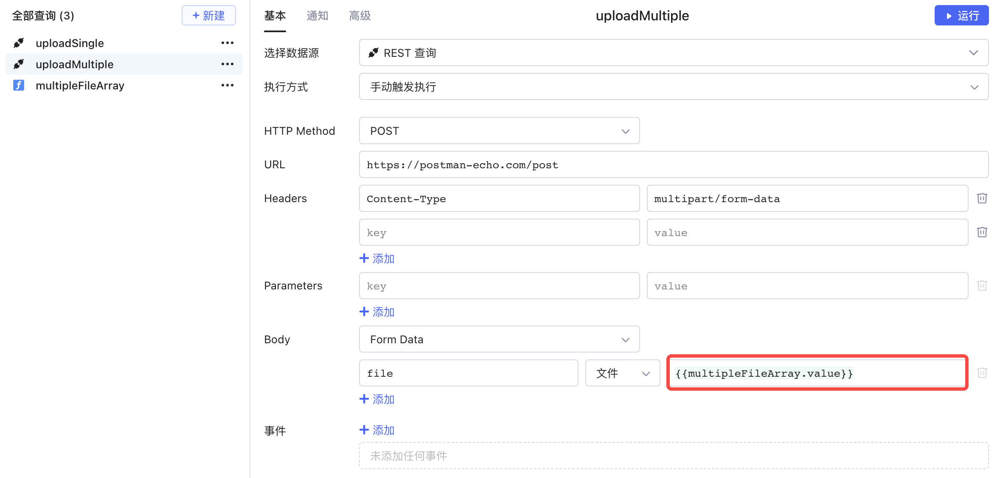

然后运行该查询，返回结果如下图所示，其中包含了图片的文件名和 Base64 编码后的内容。

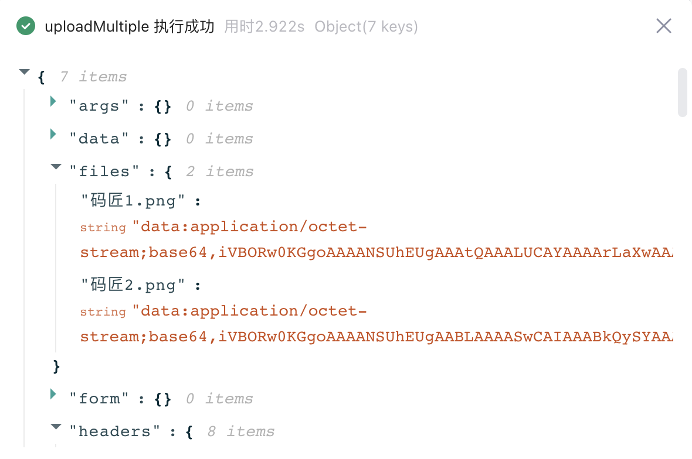

插入一个[列表](./listView.md)组件，用于展示查询的返回结果。

* 列表的行数可通过查询返回结果中 `files` 字段中的对象个数获得，即 `{{Object.keys(uploadMultiple.data?.files?? []).length}}`。
  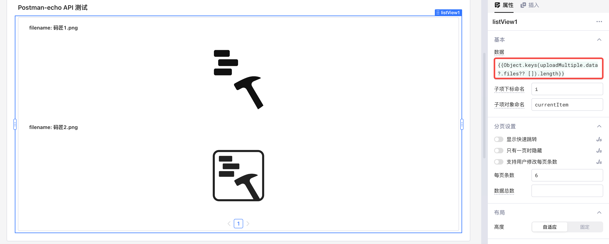
* 图片的文件名可通过 `{{Object.keys(uploadMultiple.data.files)[i]}}` 访问。
  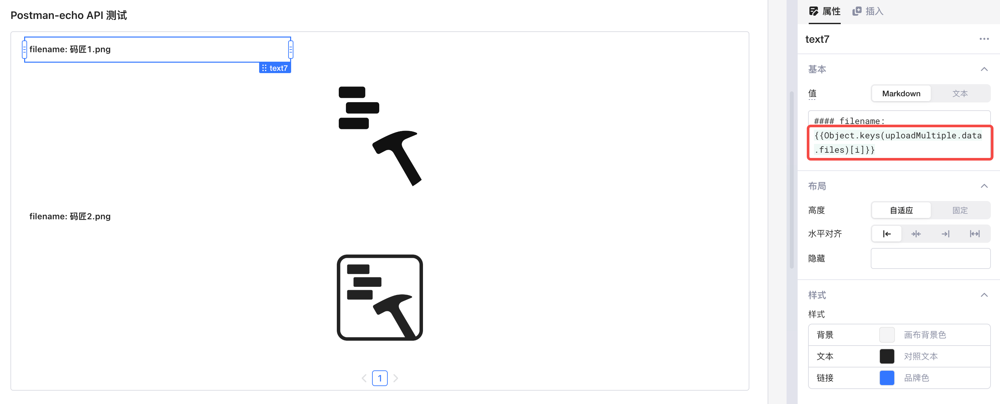
* 图片的内容可通过 `{{Object.values(uploadMultiple.data.files)[i]}}` 访问。
  