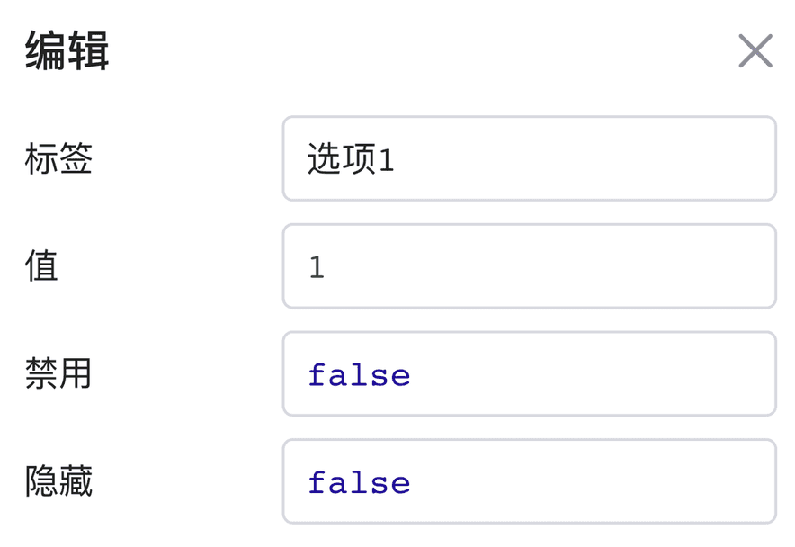
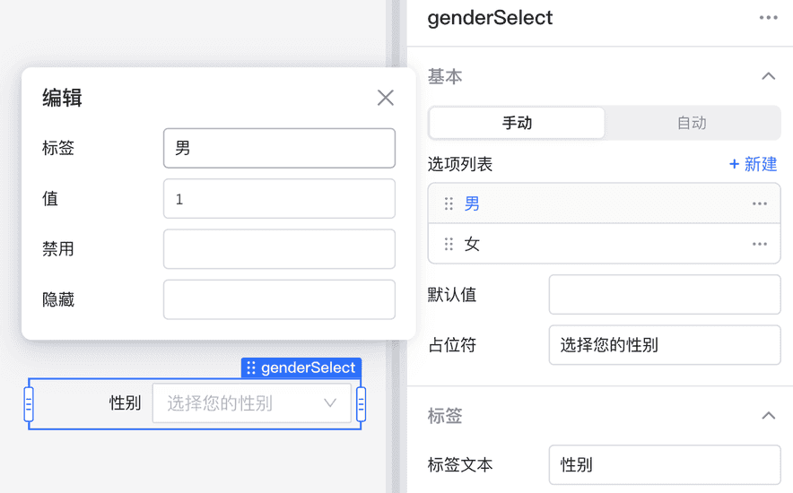
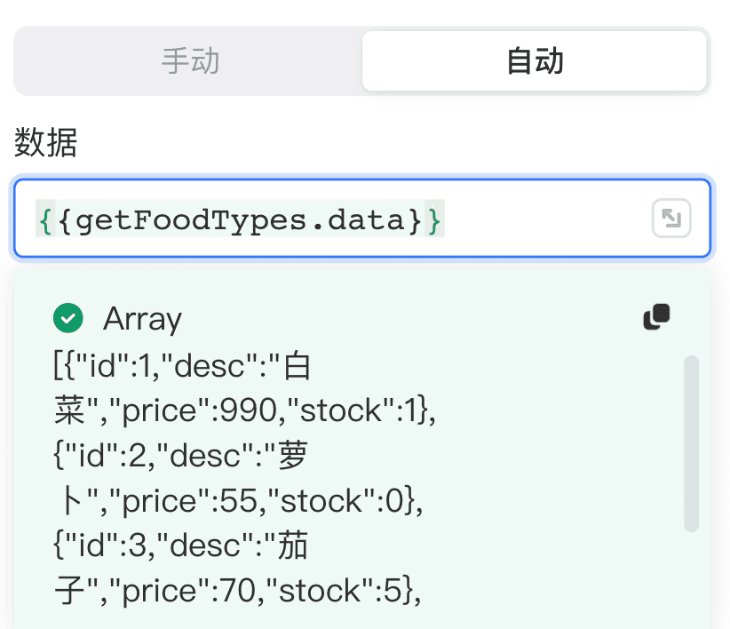
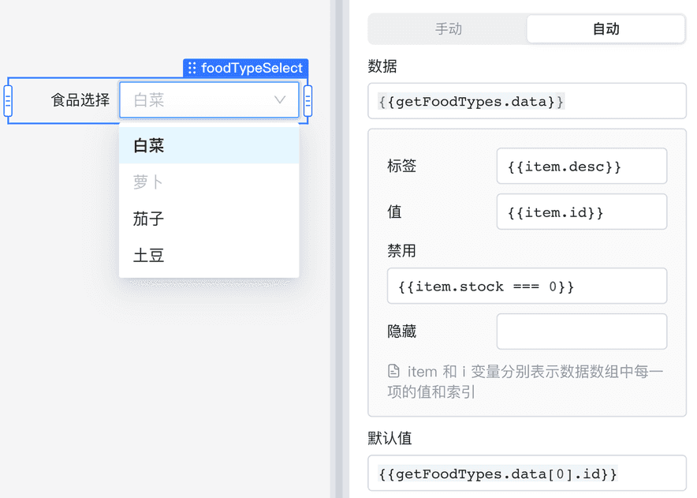

# 选项列表配置

有选择功能的组件，如： **下拉菜单** 、 **选择器** 、**多项选择器**等，它们的属性面板都包含选项列表的编辑，选项列表的每个**选项**都包含四个属性配置： **标签** 、 **值** 、**禁用**和 **隐藏** 。本节将介绍选项属性，以及如何手动/自动配置选项列表。

## 选项属性

选项属性介绍如下：

* **标签：** 选项展示文案
* **值：** 选项被选中后对应的值
* **禁用：** 禁用当前选项（默认值为 false）
* **隐藏：** 隐藏当前选项（默认值为 false）

> #### 💡 说明
>
> 选项**值**需保证唯一性，如果选项值出现重复，只会展示第一个该值的选项。
>

## 手动配置选项

首先选择**手动**模式，单击**+新建**添加新选项并对属性进行配置，或单击现有选项进行编辑。可单击**…图标**复制或删除一个选项。

> #### 💡 说明
>
> 以下情况，推荐手动配置选项：
>
> * 选项数量少。
> * 静态选项（不是来源于数据库或者 API）。
>

## 自动配置选项

选择**自动**模式，在**数据**输入框中输入 JavaScript 表达式，数据源数组中的元素将自动映射为选项。例如：通过 `{{getFoodTypes.data}}` 获取食品列表查询结果，数组每一项的格式包含 `id`、`desc`、`price`、`stock(库存)` 属性。

使用 `item` 引用当前选项的内容，`i` 是当前选项的下标（从 0 开始），可以利用 `item` 与 `i`  编写 JavaScript 表达式灵活控制选项属性。上述例子中，食品列表选项属性可以参考如下配置：

这里通过 `{{item.desc}}` 与 `{{item.id}}` 设置选项的标签和值，如果当前选项的库存 (stock) 为 0 `{{item.stock === 0}}`，则禁用当前选项。

> #### 💡 说明
>
> 以下情况，推荐自动配置选项：
>
> * 选项数量多。
> * 选项来自动态查询结果。
> * 多个组件引用同一选项列表。
>
