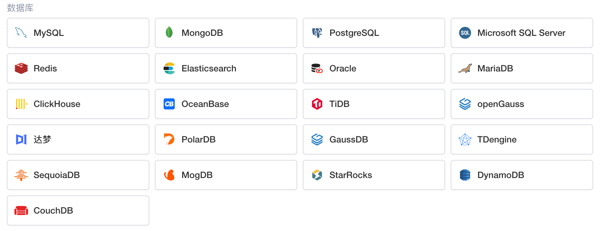

# 连接数据库

​

Lowcoder支持连接多种类型的数据库，可通过以下文档了解如何连接各种数据库：

|[连接 MySQL](../database/mysql)|[连接 MongoDB](../database/mongodb)|[连接 PostgreSQL](../database/postgresql)|[连接 Microsoft SQL server](../database/ms-SQL-server)|
| --| --| --| --|
|[连接 Redis](../database/redis)|[连接 Elasticsearch](../database/elasticsearch)|[连接 Oracle](../database/oracle)|[连接 MariaDB](../database/mariadb)|
|[连接 ClickHouse](../database/clickhouse)|[连接 OceanBase](../database/oceanbase)|[连接 TiDB](../database/TiDB)|[连接 openGauss](../database/openGauss)|
|[连接达梦 DM](../database/dameng)|[连接 PolarDB](../database/polardb)|[连接 GaussDB](../database/gaussdb)|[连接 TDengine](../database/tdengine)|
|[连接 SequoiaDB](../database/sequoiadb)|[连接 MogDB](../database/mogdb)|[连接 StarRocks](../database/starrocks)|[连接 DynamoDB](../database/dynamodb)|
|[连接 CouchDB](../database/couchdb)||||
