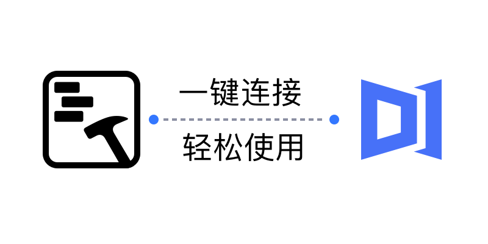
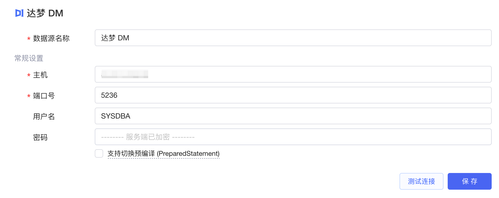
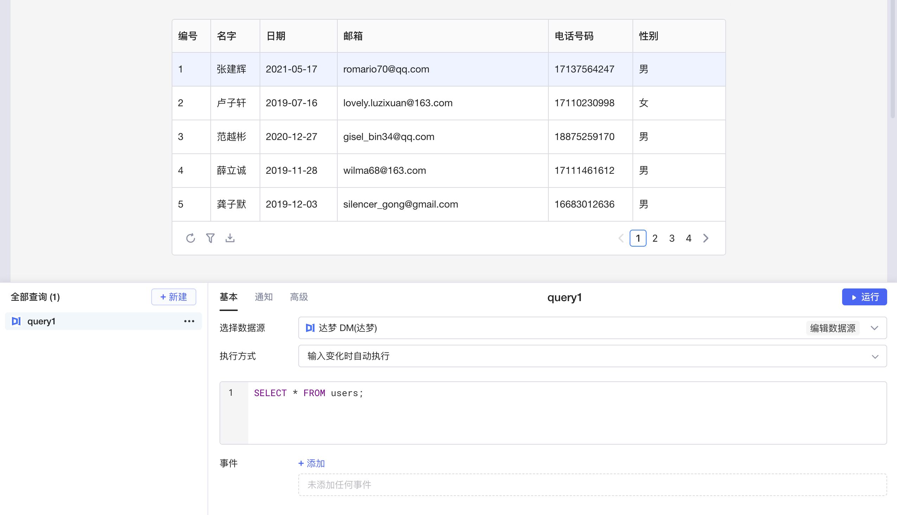

# 连接达梦 DM

​

达梦 DM 是武汉达梦自主研发的一款企业级关系型数据库管理系统。其最新版本 [DM8](https://eco.dameng.com/info/products/dm8) 提供了更高的性能、更强的安全性、更好的可扩展性和更好的兼容性，支持分布式、并行、高可用、大数据处理等，提供了多种编程语言和开发工具，已广泛应用于政府、金融、电信、物流等领域，是国内数据库领域的主要品牌之一。

目前Lowcoder已经实现了与达梦数据源的连接，支持对数据进行增、删、改、查， 同时还支持将数据绑定至各种组件，并通过简单的代码实现数据的可视化和计算等操作，能让您快速、高效地搭建应用和内部系统。

## 准备

正式开始前，您需要获取 DM 数据库的连接配置，并参考[IP 白名单](https://majiang.co/docs/ip-allowlist)文档将Lowcoder的 IP 地址添加到数据库网络的**白名单**中（按需配置）。

如果您从未使用过达梦，可参阅 DM 数据库的[快速上手](https://eco.dameng.com/document/dm/zh-cn/start/index.html)文档安装数据库。例如，您可以通过 [Docker 安装](https://eco.dameng.com/document/dm/zh-cn/start/dm-install-docker.html)数据库，安装完成后，新版本 Docker 镜像中数据库默认**用户名/密码**为 SYSDBA/SYSDBA001。

​

Lowcoder集成了达梦的 JDBC 驱动，使用户可通过Lowcoder直接连接与访问数据库。默认情况下，**主机 (host)** 为您数据库部署所在服务器的 IP 地址，**端口号 (port)** 为 `5236`​。

## 新建数据源

在[Lowcoder主页](https://cloud.majiang.co/apps)左下角，点击**数据源**进入当前企业的数据源管理界面，然后点击右上角 **+ 新建数据源** > ​**达梦**​，填写您的 DM 数据库的配置信息。点击​**测试连接**​，提示**连接成功**后再点击**保存**按钮，该达梦数据源即新建完成，并且保存至企业的数据源列表中。

​

## 创建查询

在应用编辑页面，点击**新建**创建查询，选择您的达梦数据源，然后编写 SQL 查询语句，编写完成后，即可点击​**运行**​。如果将运行结果与Lowcoder中[组件](https://majiang.co/docs/component-guides)的数据字段绑定，就能使数据可视化。关于详细的 SQL 使用教程，可参阅 DM 数据库的 [SQL开发指南](https://eco.dameng.com/document/dm/zh-cn/sql-dev/)。

​
