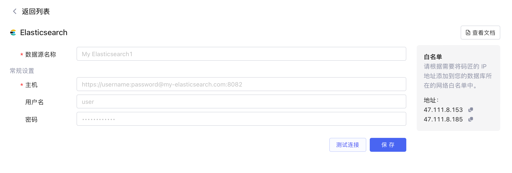
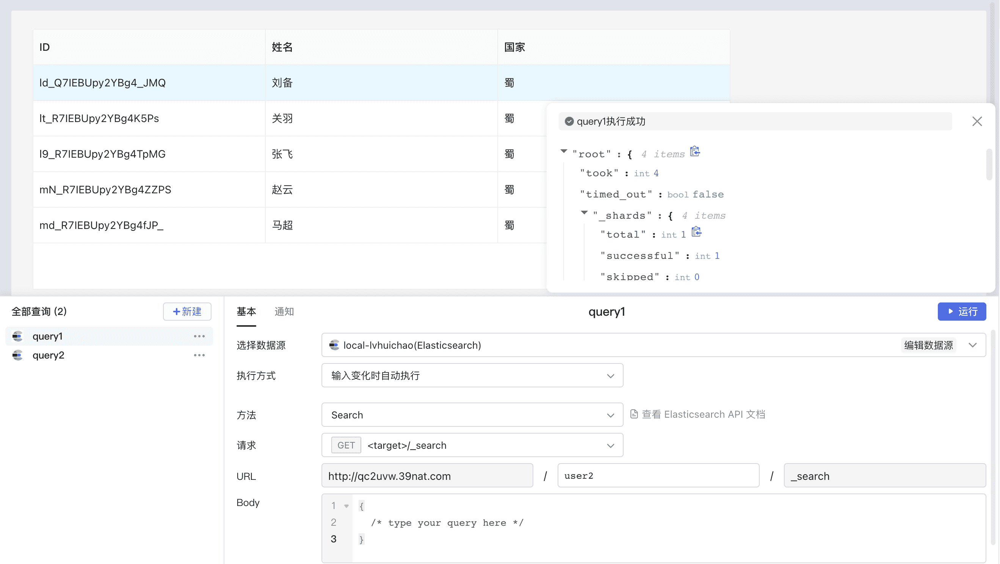

# 连接 Elasticsearch

## 准备

首先您要获取到 Elasticsearch 数据库的连接配置，然后参考[IP 白名单](../ip-allowlist)文档将Lowcoder的 IP 地址添加到数据库网络的白名单中（按需配置）。

## 新建数据源

**新建一个数据源** -> ​**Elasticsearch**​，填写数据源配置信息 -> ​**测试连接**​，连接成功后，选择​**保存**​，该 Elasticsearch 数据源即新建完成，并且保存到了您的数据源列表中。

​

## 创建查询

点击**新建**创建查询，选择您的 Elasticsearch 数据源，然后设置其方法、请求和URL等，即可点击​**运行**​。

下方案例展示了使用 ES 查询 `user2`​ 索引 (index) 下的全部数据。

​

* [准备](../database/elasticsearch#%E5%87%86%E5%A4%87)
* [新建数据源](../database/elasticsearch#%E6%96%B0%E5%BB%BA%E6%95%B0%E6%8D%AE%E6%BA%90)
* [创建查询](../database/elasticsearch#%E5%88%9B%E5%BB%BA%E6%9F%A5%E8%AF%A2)
