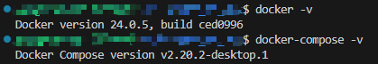

# Docker

您可以选择使用 Docker-Compose  (推荐）或者 Docker 私有化部署Lowcoder。

## 软件环境
在命令行窗口输入查看docker和docker-compose的版本
```
docker -v
docker-compose -v
```


如果报错或者版本低于以下最低版本，请自行百度搜索安装方法

* [Docker](https://docs.docker.com/get-docker/)（最低版本：20.10.7）
* [Docker-Compose](https://docs.docker.com/compose/install/)（最低版本：1.29.2）


> #### 💡 说明
>
> * 服务器最低要求：2 核 CPU 和 4 GB RAM
> * Windows 推荐使用 PowerShell 来执行以下命令

### 创建一个名为 lowcoder 的目录，用于存放Lowcoder实例数据。

```text
mkdir lowcoder
cd lowcoder
```

## 使用 Docker-Compose 部署（推荐）

#### 部署

##### 步骤 1：下载配置文件

可以使用 curl 命令进行下载：

```text
curl https://yun.mousheng.top/lowcoder/docker-compose.yml -o $PWD/docker-compose.yml
```

或者通过点击 [docker-compose.yml](https://yun.mousheng.top/lowcoder/docker-compose.yml) 进行下载。

##### 步骤 2：启动 docker 容器

运行命令启动 docker 容器：

```text
docker-compose up -d

#在linux下运行docker命令可能权限不足，请在每个docker命令前加上sudo，并按提示输入密码

sudo docker-compose up -d
```

初次启动会自动下载 docker 镜像，镜像约 400 MB。

​

镜像下载完毕后，服务会在 30 秒内完成启动，请耐心等待。

> #### 💡 说明
>
> 如果遇到镜像下载速度慢或下载失败的问题，请参阅 Docker [镜像加速器](https://yeasy.gitbook.io/docker_practice/install/mirror)文档配置国内的镜像加速源。

##### 步骤 3：查看 docker 状态

通过以下命令来查看日志：

```text
docker logs -f lowcoder
```

当看到`frontend、backend、redis、mongo entered RUNNING state`​时，Lowcoder服务已经正式启动，如下图：

​

#### 更新

执行以下命令来更新Lowcoder服务：

```text
docker-compose pull
docker-compose rm -fsv lowcoder
docker-compose up -d
```

#### 部署

执行以下命令来私有化部署Lowcoder服务：

```text
docker run -d --name lowcoder -p 3000:3000 -v "$PWD/stacks:/lowcoder-stacks" moushengkoo/lowcoder_cn:latest
```

#### 更新

执行以下命令来更新Lowcoder服务：

```text
docker pull moushengkoo/lowcoder_cn:latest
docker rm -fv lowcoder
docker run -d --name lowcoder -p 3000:3000 -v "$PWD/stacks:/lowcoder-stacks" moushengkoo/lowcoder_cn:latest
```

## 部署完毕后

访问 http://localhost:3000，选择​**立即注册**​，注册后将自动创建企业，之后您可以邀请成员进入该企业。

​

## 常见问题

* [在Lowcoder镜像中，如何如何访问宿主机 API/DB？](./visit-host-api-or-db)
