# 查询 (Query)

查询是数据源和 UI 之间的桥梁。您可以在编辑应用时或者在[查询库](https://majiang.co/docs/query-library)中创建查询。本文档将介绍如何创建和使用查询。

## 步骤 1：连接数据源

在查询编辑器中选择**新建**查询，第一步是要连接已有的数据源或[新建数据源](https://majiang.co/docs/datasource#%E6%96%B0%E5%BB%BA%E6%95%B0%E6%8D%AE%E6%BA%90)，所连接的数据源不同，那么查询编辑器面板展示的也不同，与数据进行交互的方式也会有所不同。

下面分别选择连接 MySQL 数据源、REST API 数据源，其查询面板展示如下：

**       **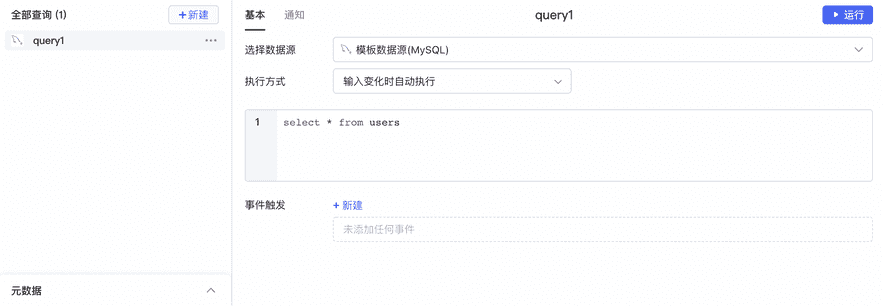[           ](https://majiang.co/static/355179a6d80b562a1e87b81379775d1b/e8f1b/datasource.png)

**       **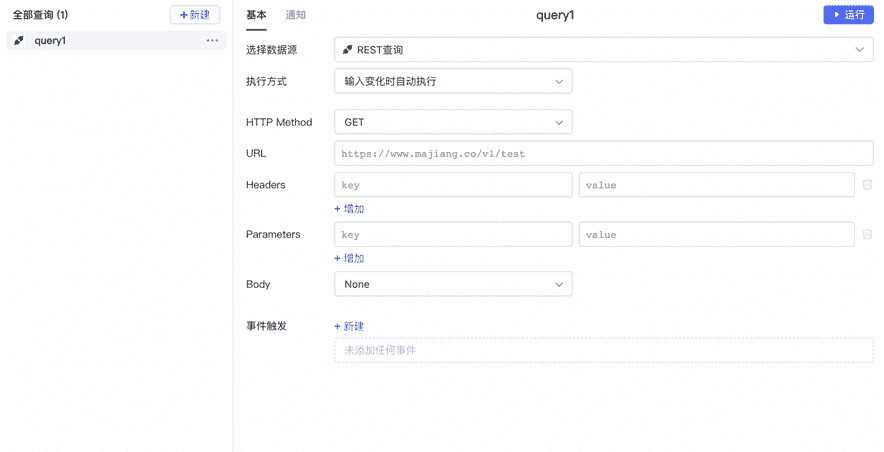[           ](https://majiang.co/static/00cba2af014cb0837b47c088cd078529/0f96c/datasource2.png)

## 步骤 2：编写查询语句

第二步是编写查询语句。下图以 MySQL 数据源编写 SQL 为例，当您编写完成查询语句后，下方会出现实时预览框，预览框会对查询语句 `{{ }}`​ 中所写的 JS 表达式进行运算，因此您可以通过其对查询内容的正确性进行快速检查。

**       **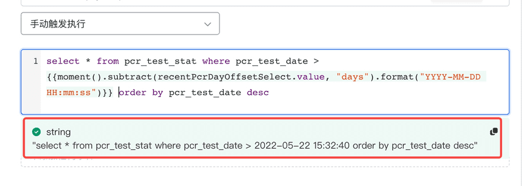[           ](https://majiang.co/static/4e552941a68e18084206ff030b8e5fff/f3abf/writesql.png)

### 元数据

对于 MySQL、PostgreSQL、MongoDB 等数据源来说，点击查询列表下方的​**元数据**​，结果会以树形结构展示当前数据库中的表以及表的字段信息。因此对于需要编写上述数据源的查询语句的时候，**元数据**会起到很好的提示作用：

**       **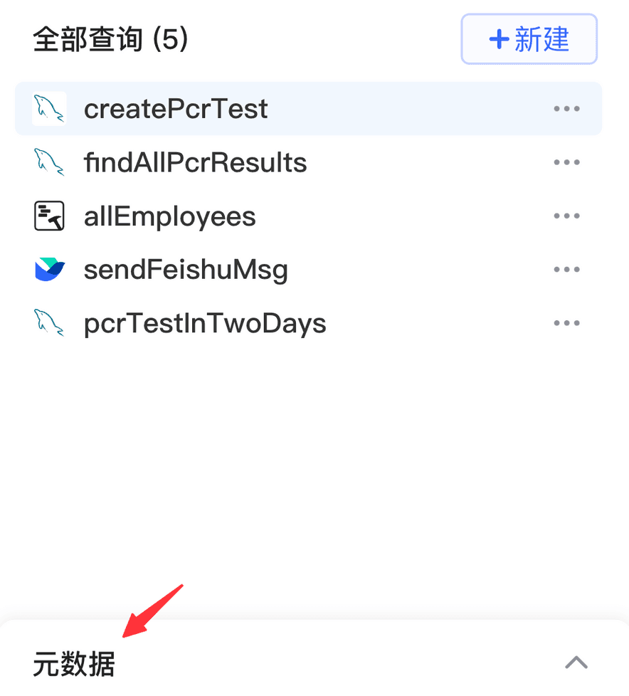[           ](https://majiang.co/static/ab97ea747e3e3225588c4cac51f1d62c/3dde1/metadata11.png)

**       **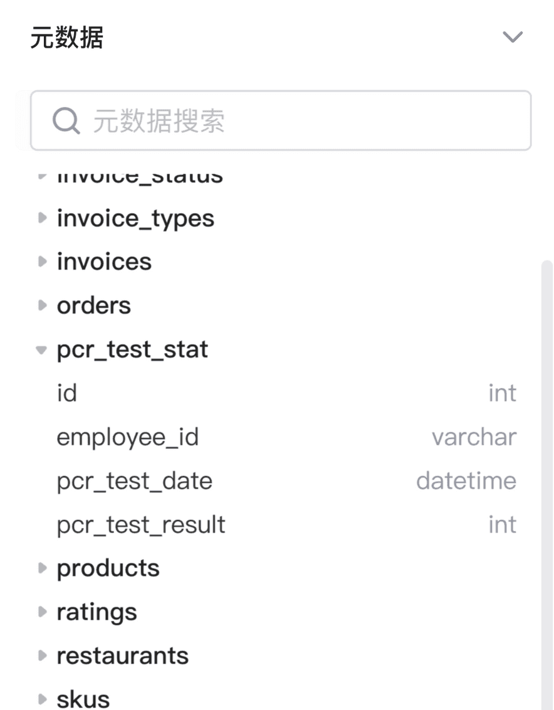[           ](https://majiang.co/static/faf75f7a0802ae8abb213c5ebc862dea/f53a0/metadata21.png)

除此之外，输入查询语句时，码匠也能根据**元数据**触发自动补全 (autosuggestion) 功能，因此您可以更快更准确地输入想要的内容。例如：输入字段的前几个字母时，下方会弹出一个菜单供您选择想要输入的字段，如下图：

**       **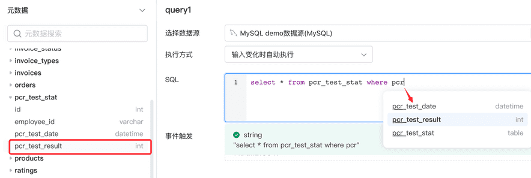[           ](https://majiang.co/static/d1423a17233dce5e129dcedbfd152685/b85c3/metadata31.png)

## 步骤 3：运行查询和通知

编写完查询语句之后，即可运行查询。查询运行的执行方式可选的有两种：输入变化时自动执行和手动触发执行。

**       **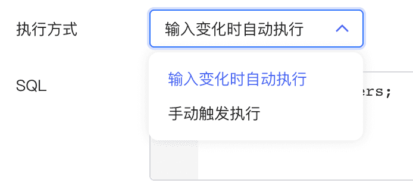[           ](https://majiang.co/static/019aa8e5f989636af197fa4adde7abed/31198/run1.png)

> #### 💡 说明
>
> 系统默认读请求（查数据）为​**输入变化时自动执行**​，写请求（增/删/改数据）为​**手动触发执行**​。如果识别到了写请求，系统会自动切换为​**手动触发执行**​。当然，您也可以自己选择其执行方式。

### 输入变化时自动执行

读请求的查询将在输入更改时自动刷新。输入指的是当前查询所依赖对象的值，值可来自组件，也可来自查询结果。例如：`select * from orders where user_id={{table1.selectedRow.id}}`​ ，当表 `table1`​ 的选中行变化时，查询结果随之自动变化；`select * from users where customer_id = {{input.value}}`​ 将在每次 `input.value`​ 被更改时自动更新查询结果。

### 手动触发执行

与自动执行相对，手动触发需要用户主动通过点击某个按钮、链接或者类似行为，查询才会运行。 对于写请求（增/删/改数据）的查询类型，并不建议选择**输入变化时自动执行**的执行方式，因为用户往往希望确认输入完毕且无误后才触发写操作。因此如果识别到了写请求，系统会自动切换为​**手动触发执行**​，此外您需要添加一个按钮或链接来主动触发该查询。 例如：对于提交一个员工的核酸结果的查询，并不需要改动一个输入值（姓名/检测日期/结果），查询就运行一次；需要的是在用户填写完所有信息并确认正确后，再点击一个按钮一次性提交，如下图：

**       **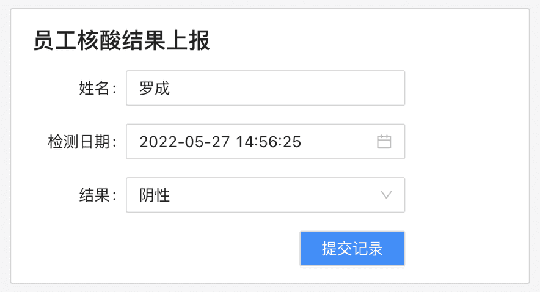[           ](https://majiang.co/static/bc3c4de0d439b91ccb3d12083aff2db9/587b0/run2.png)

下面通过一张表来表明两种查询执行方式的不同：

||**输入变化时自动执行**|**手动触发执行**|
| --| ----| ----|
|**页面加载时自动运行**|是|否|
|**可通过按钮/链接触发**|是|是|

### 通知面板

通知面板用于快速设置查询执行成功/失败后的全局提示。查询执行方式不同，**通知**面板设定不同。

* 查询执行方式为**输入变化时自动执行**时

您可以设置执行失败后通知，下方展示了使用 JS 表达式判断查询结果为空时，弹出错误信息：

**       **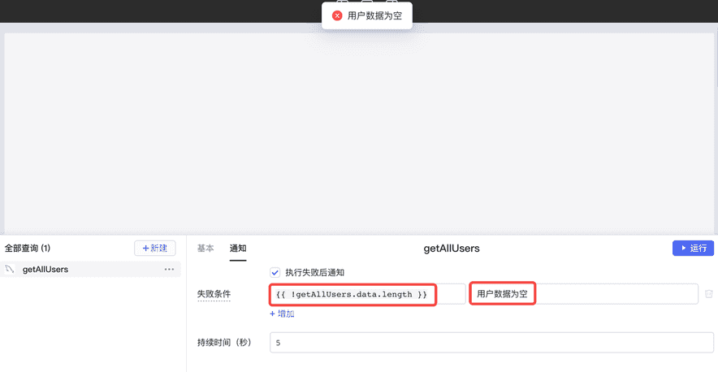[           ](https://majiang.co/static/09ecf519e07492710b43b3c86057a6b0/21b4d/tell1.png)

* 查询执行方式为**手动触发执行**时

除了配置失败通知，您还可以快速设置执行成功后的通知信息，下方展示了更新用户数据成功后通知：

**       **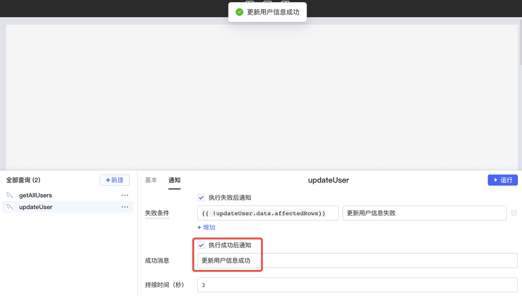[           ](https://majiang.co/static/8e76770a1e144abd38b1ef7f0eb1a7fd/21b4d/tell2.png)

> #### 💡 说明
>
> 您也可以设置查询执行成功/失败后的事件触发来实现[全局提示](https://majiang.co/docs/event-handler#%E5%85%A8%E5%B1%80%E6%8F%90%E7%A4%BA)，但码匠更建议您直接使用通知面板，因为其更方便快捷。

## 步骤 4：成功/失败后的事件动作

查询运行之后，您可能想触发更多查询或者其它操作。如：在更新某一用户信息后，希望刷新用户信息表的查询并且重置输入组件，那么您可以新建一个事件，并选择该查询执行成功后执行的动作，如下图：

**       **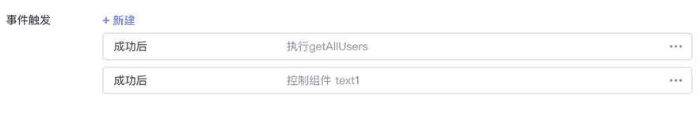[           ](https://majiang.co/static/67e1cb553e6feb24ea90ea31337faccb/21b4d/eventhandler.png)

**       **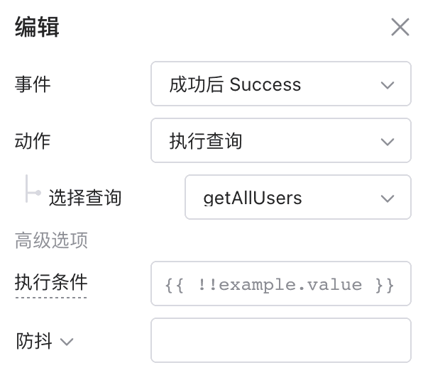[           ](https://majiang.co/static/77e915cf862bd1c1c2ce726c92be7ba5/699b7/eventhandler2.png)

**       **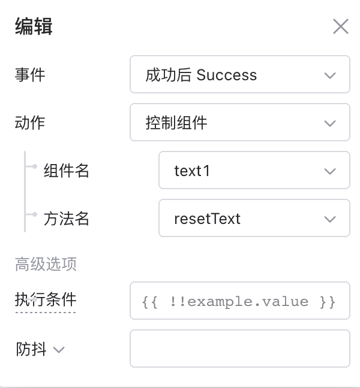[           ](https://majiang.co/static/c64a36aada079939cd44e1d6b283d665/0a47e/eventhanler3.png)

> #### ⚠️ 注意
>
> 注意避免执行查询链条中的死循环！若 `query1`​ 成功后触发执行 `query2`​，`query2`​ 成功后触发执行 `query1`​，那么就形成了一个查询的死循环，两个查询将无止尽地运行下去。
