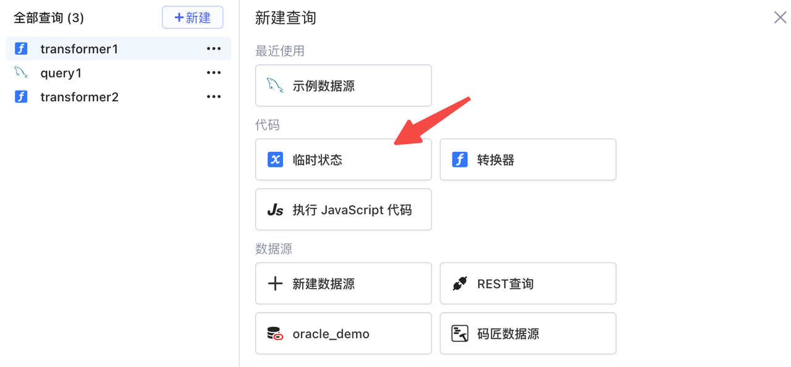
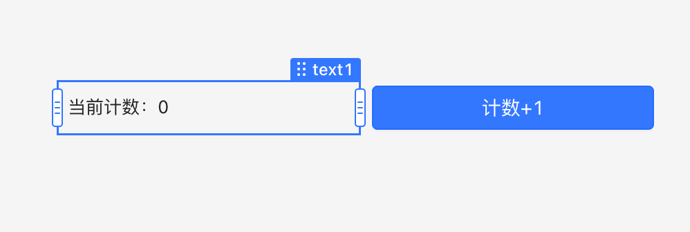
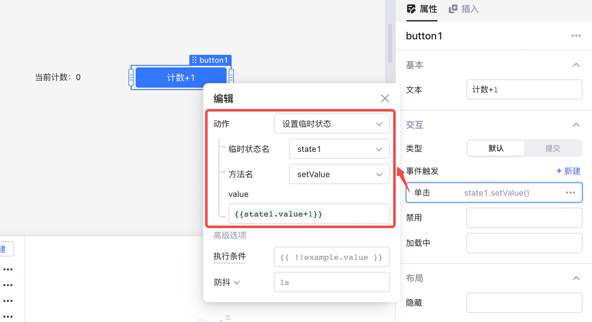
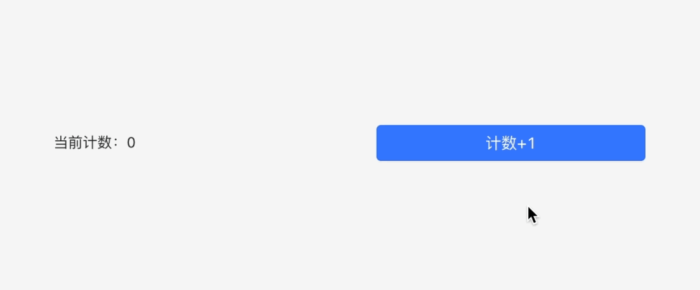
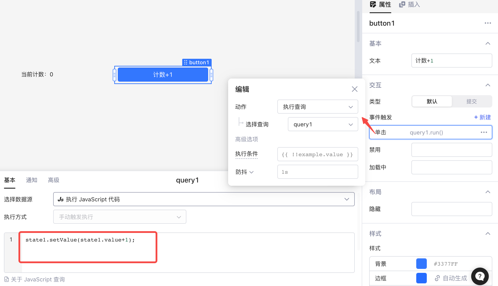
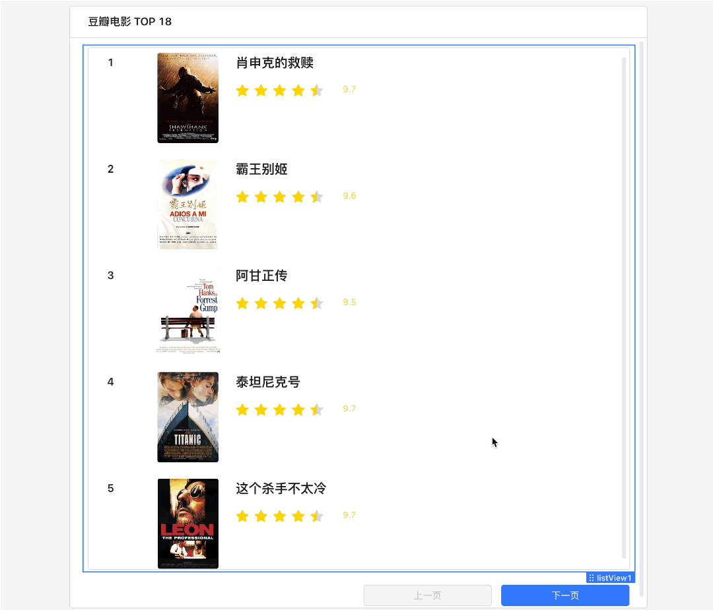
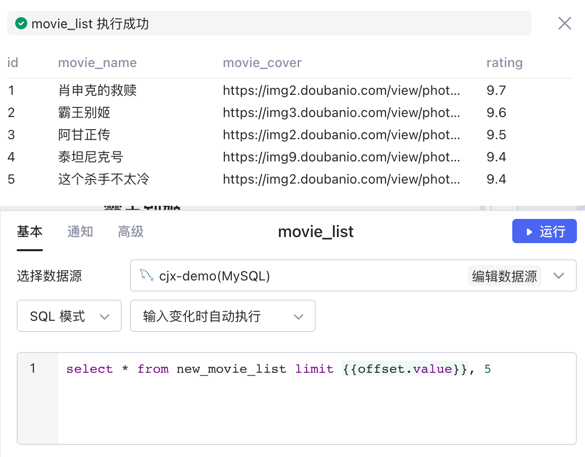
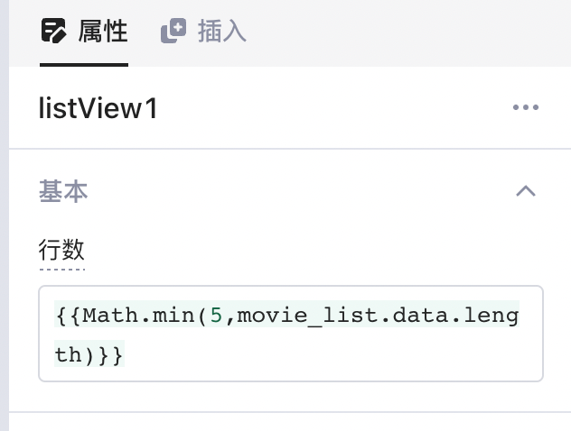
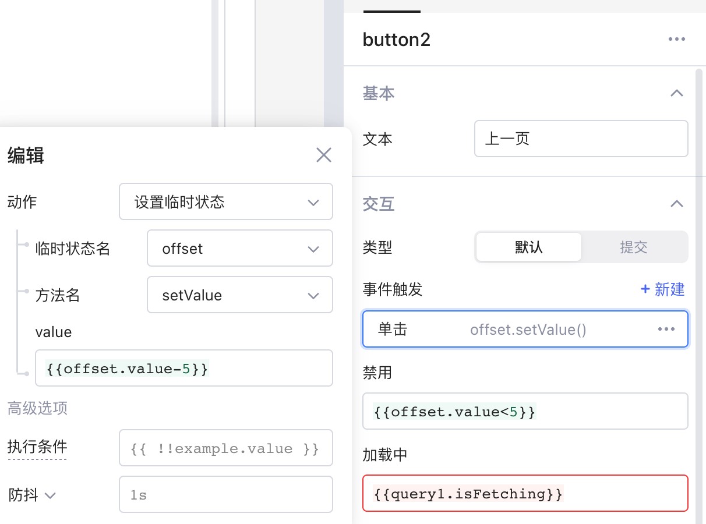
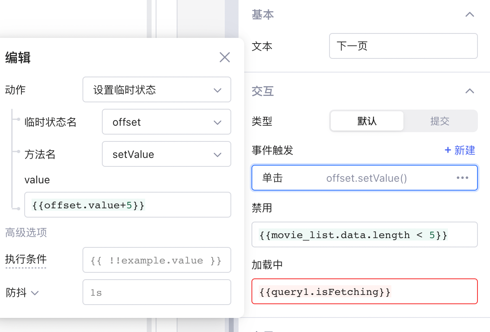

# 临时状态

临时状态 (State)

搭建应用时，可以使用**临时状态**存储局部数据。临时状态的值可以利用 `{{state.value}}`​ 访问，并支持修改。应用刷新后，临时状态会被重置。本文档介绍Lowcoder中临时状态的使用。

## 新建

点击查询编辑器面板的​**新建-&gt;临时状态**​：

​

新建完成后可以为此临时状态重命名和设置​**初始值**​：

​

## 修改临时状态

临时状态提供 setValue/setIn 方法修改值，这些方法可以在[ JavaScript 查询](../javascript-in-lowcoder/javascript-query)中调用，也可以在**事件触发-&gt;设置临时状态**时选择。

1. ​`setValue`​——设置临时状态的值。

```javascript
//state.setValue(any value)
state.setValue(3)
state.setValue(input1.value)
```

2. ​`setIn`​——若 state 的初始值是一个对象，可以设置指定路径上的值。

```javascript
//设置临时状态 state2 的初始值为：
{
  girl: {
    name: "Lucy",
    age: 18,
    city: {
      name: "Beijing"
    }
  }
  boy: {
    name: "Bob",
    age: 21,
    city: {
      name: "Anhui"
    }
  }
  ..
}
//下面代码可以修改指定路径 (path) 上的值
//state.setIn(path, any value): path 接受一个修改路径上的键的数组，路径上的对应值将被修改，并不会破坏其他值。
state2.setIn(['girl','city'],{name:'Nanjing'})
```

## 何时使用临时状态

1. 记录用户与应用交互时产生的状态；
2. 这个状态不用保存至后端，只在当前页面生命周期内生效；
3. 若Lowcoder组件/查询没有现成的属性（如 `{{table.selectedRow}}{{select.value}}`​）来满足诉求，可以利用临时状态创建一个临时属性。

## 示例：计数器

点击图中​**按钮**​，文本组件中的当前计数加 1。

​

计数器的实现：

1. 新建临时状态 `state1`​，文本组件 `text1`​ 引用 `{{state1.value}}`​。

​

2. 设置按钮单击事件触发为​**设置临时状态**​，选择方法为 `setValue`​，`value`​ 内容为 `{{state1.value+1}}`​。

​

3. 点击按钮，可以看到当前计数显示 +1：

​

上述逻辑也可以借助 JavaScript 查询实现：

​

按钮点击事件触发执行 JavaScript 查询 `query1`​：

```javascript
state1.setValue(state1.value + 1);
```

## 示例：列表翻页

利用临时状态实现的列表翻页效果：点击​**上一页**​、**下一页**可以对电影列表进行翻页。

​

1. 创建临时状态 `offset`​（作为页面的起始数据），设置其初始值为 0：

​

2. 创建查询 `movie_list`​，分页展示电影数据：

```sql
select * from new_movie_list limit {{offset.value}}, 5
```

运行查询：

​

将查询的数据分别绑定到列表中的各个组件上（请参考[使用列表组件](../listView)文档），如列表的图片组件就绑定了`{{movie_list.data[i].movie_cover}}`​：

​

设置列表行数为 `{{Math.min(5,movie_list.data.length)}}`​：

​

3. 添加按钮：

* 添加**上一页**按钮，为其设置单击触发事件为设置临时状态 `offset`​，方法选为 `setValue`​，`value`​ 为 `{{offset.value-5}}`​，当 `{{offset.value<5}}`​ 时禁用该按钮。
* 添加**下一页**按钮，为其设置单击触发事件为设置临时状态 `offset`​，方法选为 `setValue`​，`value`​ 为`{{offset.value+5}}`​，当 `{{movie_list.data.length < 5}}`​时禁用该按钮。

​

​

完成上述步骤即可实现利用临时状态实现的列表翻页效果。
