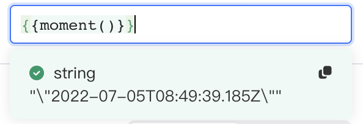
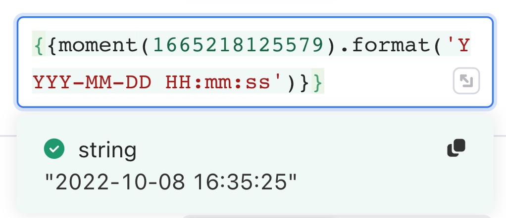
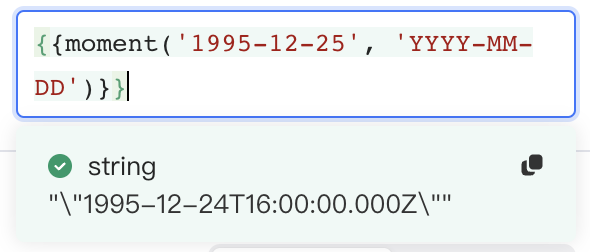
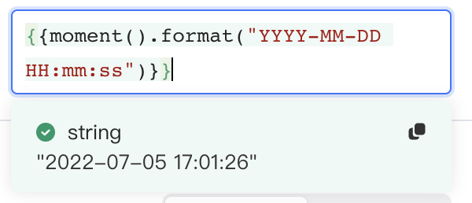
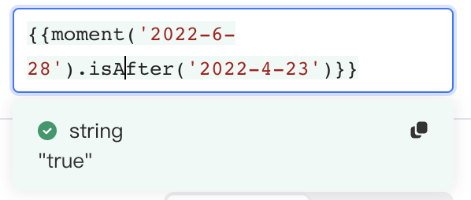

# 操作日期与时间

在搭建应用时，您可能需要对日期和时间进行操作——如：获取时间戳、转换时间格式、对日期做加减操作等，对此，Lowcoder默认装载了 [Moment.js](http://momentjs.cn/)。Moment.js 是一个JavaScript 类库，用于显示日期和时间、格式转换等操作。

## 在Lowcoder中使用 Moment.js 库

下表给出一些常用的 Moment 方法以及在Lowcoder中的应用示例，若您想了解更多操作，请参阅 [Moment.js 文档](http://momentjs.cn/docs/)。

|**方法**|**描述**|**举例**|
| ------| ----------------------------------------------------------------------| ----------------------------------------------------------------------------------|
|​`moment()`​|获取当前日期对象，默认展示格林尼治时间|​|
|​`moment(timestamp)`​|传入一个整形数值，该值表示自 1970 年 1 月 1 日 12AM UTC 以来的毫秒数|​|
|​`moment('date string', 'new format')`​|将给定格式的日期字符串转换为日期对象|​|
|​`.format('new format')`​|格式化当前日期，完整的日期格式请参阅[Moment.js 文档](http://momentjs.cn/docs/#/displaying/format/)|​`{{moment().format()}} //"2022-07-05T16:59:05+08:00" {{moment().format("YYYY-MM-DD HH:mm:ss")}} //"2022-07-05 17:01:26"`​​|
|​`.subtract(duration, 'duration type')`​|减去给定的一段时间，需要定义时间长短和类型|​`moment()`​——当前时间`{{moment().subtract(2, 'months')}}`​——当前时间减 2 个月​|
|​`.add(duration, 'duration type')`​|加上给定的一段时间，需要定义时间长短和类型|​`moment()`​——当前时间`{{moment().add(2, 'days')}}`​——当前时间加 2 天​|
|​`.isBefore('second date')`​|如果第一个给定日期在第二个给定日期之前，返回一个布尔值|​|
|​`.isAfter('second date')`​|如果第一个给定日期在第二个给定日期之后，返回一个布尔值|​|
