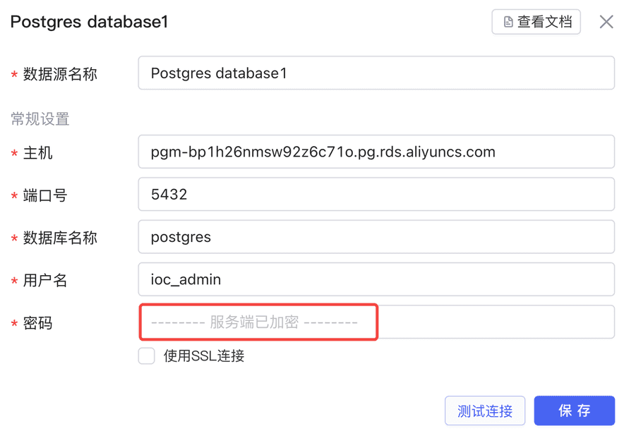

# 数据安全

## Lowcoder会存储我的业务数据吗？

​**不会**​，Lowcoder并不存储任何您从 API/数据库查询返回的数据。当您查询 API/数据库时，Lowcoder服务器基于鉴权配置连接您的数据源并转发请求，接着把数据源返回的结果数据返回到浏览器，整个过程中Lowcoder只充当一个代理层，并不保存您的数据。 此外，Lowcoder还提供了私有化部署镜像，您也可以将镜像部署到企业内部容器环境中，保证数据存放在企业内。

## 在Lowcoder云端版本填写数据库密码安全吗？

**安全，**因为

1. 所有敏感数据（如数据库密码）均经过 AES-256 加密。
2. 已填写的敏感信息，后续访问时服务端不会下发到浏览器，浏览器侧看到的是**服务端已加密**占位符。

**       **[           ](https://majiang.co/static/2c8badaf895584782c979af167600742/21b4d/security.png)

## Lowcoder还做了什么保证信息安全？

Lowcoder采取了一系列的措施来保证信息安全：

* 在Lowcoder云端版本中，所有连接均经过 TLS 加密。
* 敏感数据（如数据库访问凭证）均经过 AES-256 加密，同时云端版本私有化部署镜像中，可以自定义加密盐值 (Salt) 。
* 您可通过设置数据源访问 IP 白名单授权给Lowcoder的服务器 IP：`47.111.8.153`​、`47.111.8.185`​，保证在使用Lowcoder云端版本过程中数据不会泄漏给其他人。
* Lowcoder云端版本服务器、存储均部署在阿里云，阿里云获得 ISO 27001、SOC 1/2/3 等权威认证；同时Lowcoder云端服务器与存储均保证数据冗余，因此您不用担心单点异常或者数据丢失。
* Lowcoder云端版本的阿里云部署均开启双因素认证系统和审计日志保证数据安全。

## 问题反馈

您如果有任何关于数据安全的问题，请随时联系网页客服，Lowcoder的安全团队会尽快为您解决。
