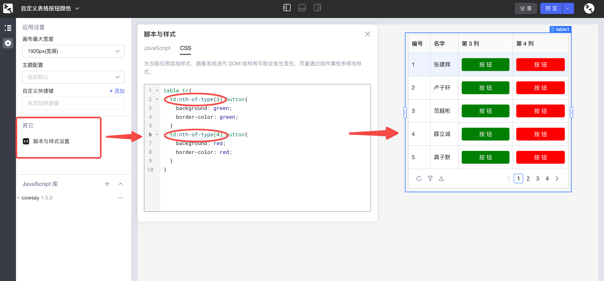
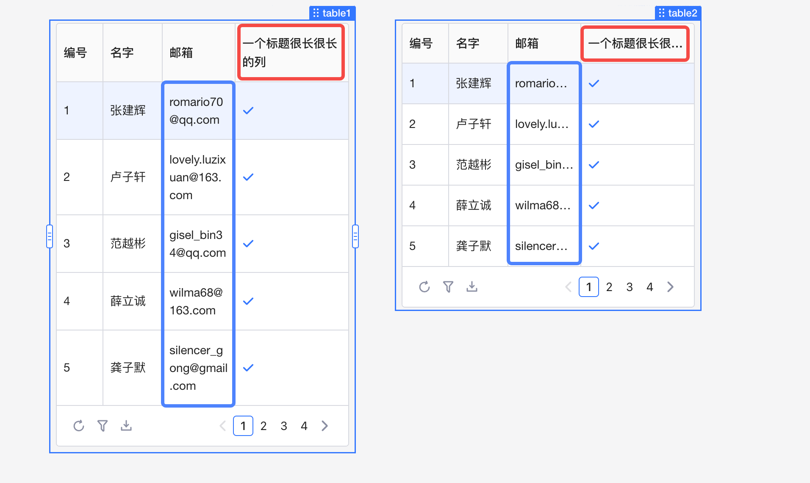
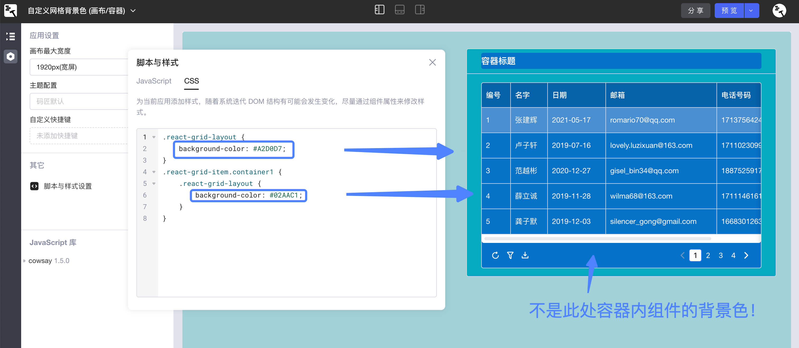
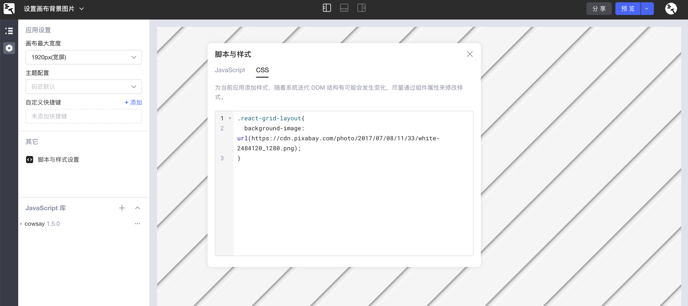

# 自定义 CSS 使用样例

本文档展示了在Lowcoder中通过编写[自定义 CSS](https://majiang.co/docs/style#%E8%87%AA%E5%AE%9A%E4%B9%89css) 代码实现丰富样式的若干 ​**demo**​。

* 如需为**单个应用**添加自定义 CSS，请参阅[应用级 CSS](https://majiang.co/docs/style#%E5%BA%94%E7%94%A8%E7%BA%A7css)；
* 如需为当前企业下**所有应用**设置预加载 CSS，请参阅[预加载 CSS](https://majiang.co/docs/style#%E9%A2%84%E5%8A%A0%E8%BD%BDcss)。

## 自定义 Markdown 字体

在应用设置中添加如下 CSS 样式，通过 [@font-face](https://developer.mozilla.org/en-US/docs/Web/CSS/@font-face) 声明展示文本的自定义字体，再应用于所有 UI 组件 (`.ui-comp-text`​) 的 Markdown 文本 (`.markdown-body`​) 中，可实现如图所示的效果：

```scss
@font-face {
  font-family: 'Fredoka One';
  font-style: normal;
  font-weight: 400;
  src: url(https://fonts.gstatic.com/s/fredokaone/v13/k3kUo8kEI-tA1RRcTZGmTlHGCaen8wf-.woff2) format('woff2');
}

.ui-comp-text .markdown-body {
  font-family: 'Fredoka One';
  font-size: 30px;
}
```

​

## 自定义表格按钮颜色

在应用设置中添加如下 CSS 样式，可以为所有表格中第三列 (`td:nth-of-type(3) button`​)、第四列的按钮颜色设置为绿色 (green) 和红色 (red)，实现如图所示的效果：

```scss
table tr{
  td:nth-of-type(3) button{
    background: green;
    border-color: green;
  }
  td:nth-of-type(4) button{
    background: red;
    border-color: red;
  }
}
```

​

## 实现表格文本自动换行

在应用设置中添加如下 CSS 样式，可以使表格 `table1`​ 中表格行文本 (`<tr>`​) 实现自动换行，从而实现与图中另一表格 `table2`​ 不同的效果。同理，该样式也适用于表格列标题 (`<th>`​) 和表格单元格 (`<td>`​)。

```scss
.table1 {
  tr div {
    white-space: pre-wrap;
    word-break: break-word;
    max-height: unset;
  } 
}
/* <th>: table head; <tr>: table row; <td>: table data */
```

​

## 自定义网格背景色 (画布/容器)

在应用设置中添加如下 CSS 样式，可以自定义应用编辑界面的画布 (Canvas)、容器（如容器组件 `container1`​）等的​**网格背景色**​。请注意，这里的网格背景色不是容器或画布中组件的背景色，而是容器或画布中的​**空白部分**​。

```scss
.react-grid-layout {
    background-color: #A2D0D7;
}
.react-grid-item.container1 {
    .react-grid-layout {
        background-color: #02AAC1;
    }
}
```

​

## 设置画布背景图片

在应用设置中添加如下 CSS 样式，可以为应用编辑界面的画布 (Canvas) 即整个应用添加背景图片，需提供图片的 URL。

```scss
.react-grid-layout{
  background-image: url();
}
```

​
