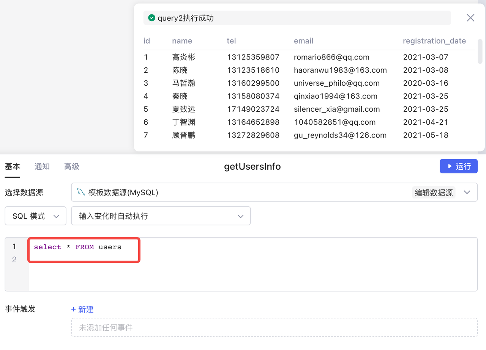
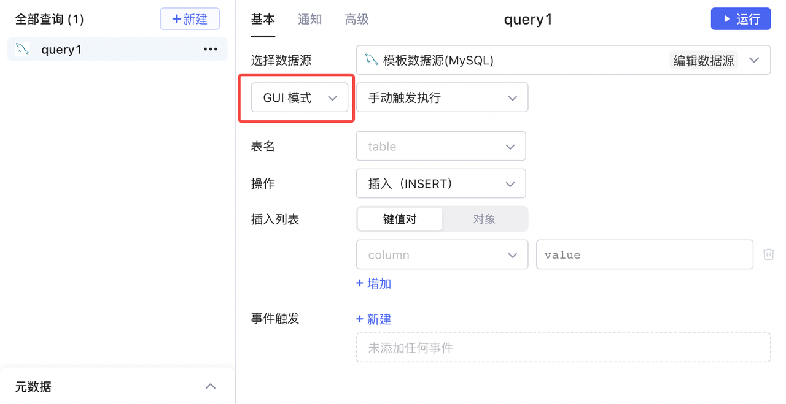
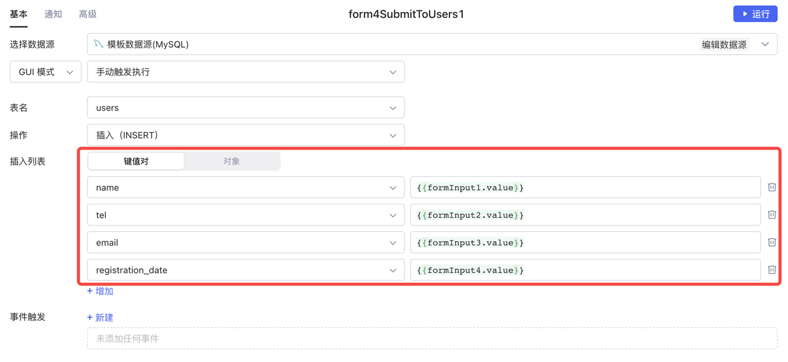
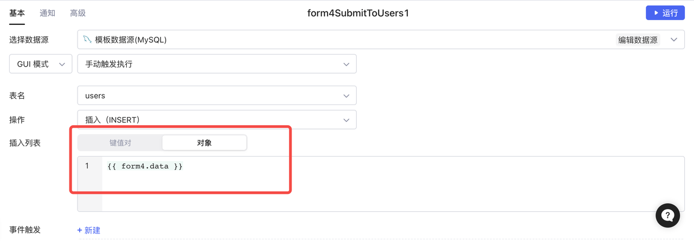
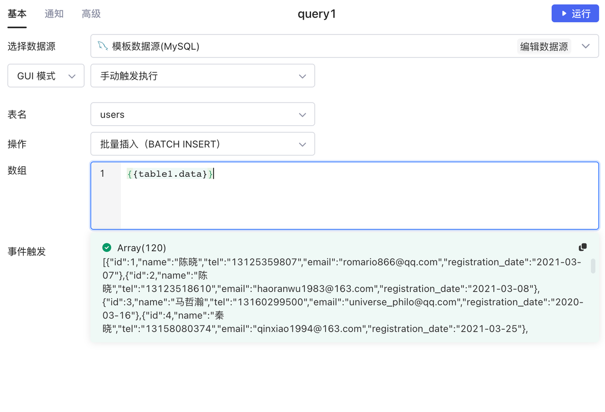

# 使用 SQL

在Lowcoder中，您如果连接的是 SQL 类数据源（MySQL、PostgreSQL、Microsoft SQL Server 等），则可以通过编写 SQL 语句或者 GUI 模式构建查询。

## 读请求

若创建的查询需要从数据源中读取数据，则可以通过编写 SQL 语句实现，主要为查询 (SELECT) 语句。

例如：新建查询 `getUserInfo`​ 查询所有用户数据：

```sql
select * from users;
```

​

通过 `getUserInfo.data`​ 访问查询结果，SQL 查询以 Array 结构返回数据：

```json
[
    {"id":1,"name":"高炎彬","tel":"13125359807","email":"romario866@qq.com","registration_date":"2021-03-07"},
    {"id":2,"name":"武昊然","tel":"13123518610","email":"haoranwu1983@163.com","registration_date":"2021-03-08"},
    ...
]
```

## 读请求案例

接下来展示一些实际业务场景中的读请求案例。

### 完全匹配

查询名字与输入文本完全匹配的用户：

```sql
select * from users where name = {{input1.value}}
```

若输入框组件 `input1`​ 输入「李小明」，则会相应匹配到 `users`​ 表中「李小明」的数据。

### 模糊匹配

查询名字与输入文本部分匹配的用户：

```sql
select * from users where name like {{'%' + input1.value + '%'}}
```

若输入框组件 `input1`​ 输入「李」，则会相应匹配到 `users`​ 表中「李小明」「李梅梅」等名字里有「李」的用户数据。

### 条件匹配

```sql
select * from users where {{!select1.value}} OR status = {{parseInt(select1.value)}}
```

根据下拉框选择筛选用户状态：

* 如果 `select1.value`​ 为空，当前 SQL 等价于 `select * from users where (true OR status = '')`​，此时返回所有用户。
* 如果 `select1.value`​ 不为空，当前 SQL 等价于 `select * from users where (false OR status = 0/1/2)`​，此时返回特定状态用户。

### 对查询结果排序

```sql
select * from orders where date = {{date1.value}} order by amount
```

查询 orders 表中与日期输入框组件 `date1`​ 输入日期相同的数据，查询结果按照 `amount`​ 字段排序。

### 动态排序

Lowcoder默认开启 [PreparedStatement](./using-sql#%E4%BD%BF%E7%94%A8%E9%A2%84%E7%BC%96%E8%AF%91(preparedstatement)%E9%98%B2%E6%AD%A2sql%E6%B3%A8%E5%85%A5)，因此不能使用这样的写法进行 **order by** 拼接：

```sql
-- ❌ 不支持这种写法：
select * from users {{ select1.value === '1' ? 'order by tel desc' : 'order by name desc'}} 
```

下面展示了如何使用 **case when** 语法实现基于 `select1.value`​ 动态排序：

```sql
select * from users
order by
case when {{ select1.value === '1' }} then tel end desc,
case when {{ select1.value === '2' }}  then name end desc
```

* 如果 `select1.value`​ 为 1，按照电话号码 `tel`​ 字段降序排序。
* 如果 `select1.value`​ 为 2，按照姓名 `name`​ 字段降序排序。

### 使用 IN 操作符

如果希望使用 IN 操作符判断字段是否在集合中，可以使用 `in ( {{...}} )`​ 语法，注意 `{{...}}`​ 结果必须为 Array 类型：

```sql
-- ids 类型为 Array，值为 [1,2,3]
select * from users where id in ({{ids}}); 
```

上面例子查询 id 在数组列表 `ids [1,2,3]`​ 中的用户信息，结果返回 id 分别为 1/2/3 的用户数据。

### 服务端分页

当数据库表行数较多，可以结合**表格**组件的 `pageOffset`​、`pageSize`​ 属性实现服务端分页，详情可参考表格组件的[服务端分页](./component-guides/using-table#%E6%9C%8D%E5%8A%A1%E7%AB%AF%E5%88%86%E9%A1%B5)。

## 写请求（增/删/改）

对数据源中的数据写操作，包括：

* 增加 (INSERT)
* 删除 (DELETE)
* 修改 (UPDATE)

### 增加数据

在数据源的 `crm_customers`​ 表中新增一条数据：

```sql
insert into crm_customers (name, phone, wechat, amount, owner, stage)
values ({{modal_lead_input_name.value}},
{{modal_lead_input_phone.value}},
{{modal_lead_input_wechat.value}},
{{modal_lead_numberInput_amount.value}},
{{modal_lead_input_owner.value}},
{{modal_lead_select_stage.value}})
```

### 删除数据

根据日期删除 `orders`​ 表中过期订单：

```sql
delete from orders where order_date < {{date1.value}}
```

### 修改数据

根据表格 `userInfo`​ 当前选中行用户，修改 `user`​ 表中对应用户相关字段：

```sql
update users set 
name = {{name_input.value}} ,
sex = {{sex_set.value}} , 
tel = {{tel_input.value}} , 
email = {{email_input.value}} , 
registration_date = {{date_input.value}} , 
status = {{status_set.value}} 
where 
id = {{userInfo.selectedRow.id}}
```

## GUI 模式

Lowcoder支持通过 GUI 模式编写查询（目前支持 MySQL 数据源）。GUI 模式支持大多数写入操作：插入、更新、删除、批量插入等。利用 GUI 构建数据写入，更加简便且不易出错，并且它有助于避免意外的破坏性操作，比如删除表。

新建查询，选择 MySQL 数据源，选择 GUI 模式，然后便可以利用 GUI 来构建查询。

​

**操作**选项中，可选择的操作有五种：

​

### 键值对或对象的形式写入数据

您可以选择以**键值对或对象**的形式来传入参数，下图展示了使用**键值对**插入数据的配置，键值对中的键 (key) 对应数据库中表的列 (column)，值对应实际写入的数据：

​

**对象**本身也是键值对结构，所以原理上与键值对逻辑保持一致。下图展示了[结合表单 (Form) 组件](./using-form#%E8%A1%A8%E5%8D%95%E6%8F%90%E4%BA%A4)，可以轻松实现对象数据的传入：

​

### 筛选条件和允许修改多行

对于**更新、删除**操作，首先要通过填写筛选条件部分过滤出目标数据（对应 SQL 中的 `where`​ 语句）：

​

如果筛选器的结果包含多行，Lowcoder默认只修改其中一条数据（对应 SQL 中的 `limit 1`​），如果想要更新多行筛选结果，需手动勾选​**允许修改多行**​：

​

### 批量插入

您如果想对数据库进行**批量插入**操作，可以直接传入一个要更新的对象数组：

​

## 使用预编译 (PreparedStatement) 防止 SQL 注入

为了防止 [SQL 注入](https://www.runoob.com/mysql/mysql-sql-injection.html)，Lowcoder默认对 SQL 查询进行预编译 (PreparedStatement)，然后 `{{ }}`​ 内的 JavaScript 表达式对应的值会被作为参数进行替换并得到最终 SQL。这样即便 `{{ }}`​ 参数里有敏感字符（如 `or '1=1'`​）也只被作为字段值而非 SQL 指令处理。

```sql
-- 1. 先转化为预编译 SQL：
--     select * from users where name = ? and gender = ?
-- 2. 再绑定参数 {{input1.value}} {{parseInt(select1.value)}} 对应的值
select * from users 
where name = {{input1.value}} and gender = {{parseInt(select1.value)}}
```

预编译 (PreparedStatement) 的开启也意味着下面这种写法是不生效的（ MySQL/PostgreSQL 等不支持动态绑定表名）：

```sql
-- ❌：不支持这种类型的预编译 SQL：select * from ? 
select * from {{input1.value === 'getUsers' ? 'users' : 'payments'}}
```

为了解决这个问题，您可以创建两个查询`select * from users`​ 、`select * from payments`​，其数据分别为 `getUsers.data`​、`getPayments.data`​。然后根据 `input1`​ 的值选择对应查询的数据：

```javascript
{{ input1.value === 'getUsers' ? getUsers.data : getPayments.data }}
```

### 关闭预编译 (PreparedStatement)

首先点击编辑数据源：

**       **[           ](https://majiang.co/static/281ef4679d176bfb45225326e76d594a/21b4d/add1.png)

然后在数据源配置窗口中勾选支持切换预编译 (PreparedStatement)后，点击保存： **       **[           ](https://majiang.co/static/8a59cac00df49eb682787bb3793223b9/b97f6/add2.png)

回到查询编辑面板，切换到高级面板，勾选禁用预编译 (PreparedStatement)： **       **[           ](https://majiang.co/static/ebd5f3a9dc3bd9edcce3ee3ba25e5719/62de4/add3.png)

这样，预编译 (PreparedStatement) 即被关闭。
