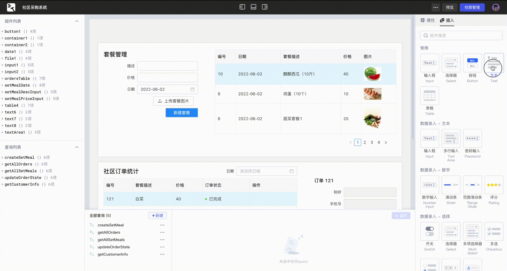

# 码匠是什么

码匠是什么

码匠是一款开发者友好的低代码平台。通过开箱即用的组件库、所见即所得 UI 布局以及连接数据库/API，您可以快速开发内部应用，同时无需关注复杂繁琐的前后端交互、应用的安装与部署，让您专注于业务发展。

​​

## 如何搭建一个应用？

只需通过几个步骤，便可搭建和使用您的内部应用：

1. 通过 GUI 快速[连接数据源](https://majiang.co/docs/datasource)。
2. 编写少量代码[构建查询](https://majiang.co/docs/how-to-write-query)。
3. 使用开箱即用的组件库轻松[搭建应用界面](https://majiang.co/docs/drag-and-drop)，使用 [JavaScript 表达式](https://majiang.co/docs/javascript-in-majiang/writing-javascript)绑定查询数据。
4. 触发查询/控制组件/响应用户行为/...，通过设置[事件触发](https://majiang.co/docs/event-handler)提供响应式 UI 交互。
5. [预览](https://majiang.co/docs/app-release)并将您的应用[分享给其他人](https://majiang.co/docs/member-manage#%E6%B7%BB%E5%8A%A0%E6%88%90%E5%91%98)。

## 问题反馈和帮助

我们的文档无法涵盖所有内容，因此，您有任何问题，请随时咨询右下角网页客服，或者扫描[关于我们](https://majiang.co/about-us/)页面中二维码获取专属服务。

* [如何搭建一个应用？](https://majiang.co/docs#%E5%A6%82%E4%BD%95%E6%90%AD%E5%BB%BA%E4%B8%80%E4%B8%AA%E5%BA%94%E7%94%A8%EF%BC%9F)
* [问题反馈和帮助](https://majiang.co/docs#%E9%97%AE%E9%A2%98%E5%8F%8D%E9%A6%88%E5%92%8C%E5%B8%AE%E5%8A%A9)
